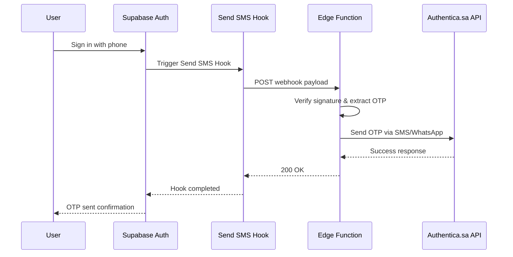

# [Supabase](https://supabase.com) Send SMS Hook with [Authentica.sa 🇸🇦](https://authentica.sa/en/)

💚 _A gift to the [amazing team](https://github.com/AuthenticaSA) behind [Authentica.sa](https://authentica.sa/en/)_

## Overview

This guide shows how to implement a custom SMS provider (Authentica.sa) for [Supabase Auth](https://supabase.com/docs/guides/auth) using the [Send SMS Hook](https://supabase.com/docs/guides/auth/auth-hooks/send-sms-hook). This replaces the default [Twilio integration](https://supabase.com/docs/guides/auth/phone-login?showSmsProvider=Twilio#!) with Authentica.sa's SMS service.

## Prerequisites

- [Supabase project](https://supabase.com) (hosted or self-hosted)
- Authentica.sa account with API credentials
- [Supabase CLI](https://supabase.com/docs/guides/local-development/cli/getting-started) (for local development)
- [Deno](https://deno.com) runtime (for Edge Functions)

## Architecture



## Step 1: Create the [Edge Function](https://supabase.com/docs/guides/functions)

Create a new [Supabase Edge Function](https://supabase.com/docs/guides/functions) that will handle the SMS sending:

```bash
supabase functions new supabase-authentica-sms-hook
```

## Step 2: Edge Function Implementation

The Edge Function is already implemented [here](./index.ts). See/copy the source code for the full implementation.

## Step 3: Environment Variables Configuration

### Environment Variables Reference

| Variable                       | Required | Description                                                                                      |
| ------------------------------ | -------- | ------------------------------------------------------------------------------------------------ |
| `AUTHENTICA_API_KEY`           | Yes      | Your Authentica.sa API key for authentication                                                    |
| `AUTHENTICA_SMS_TEMPLATE_ID`   | Yes       | Template ID for SMS delivery (default: `31`)                                                     |
| `AUTHENTICA_WHATSAPP_TEMPLATE_ID` | Yes    | Template ID for WhatsApp delivery. Required to enable WhatsApp routing                           |
| `FALLBACK_EMAIL`               | No       | Fallback email for SMS delivery failures (default: `noreply@yourdomain.com`)                     |
| `SEND_SMS_HOOK_SECRET`         | Yes      | Webhook secret for payload verification (generated in Supabase Dashboard)                        |
| `SMS_COUNTRY_CODES`            | No       | Comma-separated country codes that should use SMS (e.g., `+966,+971,+973`). Empty = all use SMS  |

### SMS vs WhatsApp Delivery

The function supports automatic routing between SMS and WhatsApp based on phone number country codes. This is useful because WhatsApp is significantly cheaper (~20x) for international numbers.

> [!IMPORTANT]
> To enable WhatsApp delivery, you must set `AUTHENTICA_WHATSAPP_TEMPLATE_ID` with a valid WhatsApp template from your Authentica.sa dashboard. SMS and WhatsApp require different templates.

| `SMS_COUNTRY_CODES` Value | Behavior                                              |
| ------------------------- | ----------------------------------------------------- |
| Not set / empty           | All numbers use **SMS** (default behavior)            |
| `+966`                    | Saudi numbers (+966) use SMS, all others use WhatsApp |
| `+966,+971,+973`          | Saudi/UAE/Bahrain use SMS, all others use WhatsApp    |

> [!NOTE]
> Authentica.sa supports an automatic fallback strategy - if a number doesn't have WhatsApp, it will automatically send via SMS instead. This feature needs to be enabled from your [Authentica.sa dashboard](https://authentica.sa).

**Examples:**

```bash
# Default: All numbers use SMS
SMS_COUNTRY_CODES=""

# Saudi Arabia only uses SMS, others use WhatsApp
SMS_COUNTRY_CODES="+966"

# GCC countries use SMS, others use WhatsApp
SMS_COUNTRY_CODES="+966,+971,+973,+965,+968,+974"
```

### For Local Development

Create `supabase/functions/.env`:

```bash
# Authentica.sa API Configuration
AUTHENTICA_API_KEY="$2y$10$XXXXXXXXXXXXXXXXXXXXXXXXXXXXXXXXXXXXXX"
AUTHENTICA_SMS_TEMPLATE_ID="9"
# WhatsApp template ID (required to enable WhatsApp delivery)
AUTHENTICA_WHATSAPP_TEMPLATE_ID=""
FALLBACK_EMAIL="noreply@yourdomain.com"

# Webhook secret from Supabase Dashboard
SEND_SMS_HOOK_SECRET="your_webhook_secret_here"

# Country codes that should use SMS (others will use WhatsApp)
# Leave empty or unset to use SMS for all numbers
# NOTE: WhatsApp will only be used if AUTHENTICA_WHATSAPP_TEMPLATE_ID is set
SMS_COUNTRY_CODES="+966"
```

### For Production (Supabase Dashboard)

Navigate to your project's Edge Functions settings and add the environment variables listed in the table above.

## Step 4: Local Development Setup

### Update `config.toml` for local development:

```toml
[auth.hook.send_sms]
enabled = true
uri = "http://localhost:54321/functions/v1/supabase-authentica-sms-hook"
secrets = "v1,whsec_your_local_secret_here"
```

### Start the Edge Function locally:

```bash
# Start Supabase local development
supabase start

# Serve the function (with --no-verify-jwt for auth hooks)
supabase functions serve supabase-authentica-sms-hook --no-verify-jwt --env-file supabase/functions/.env
```

## Step 5: Deploy to Production

### Deploy the Edge Function:

```bash
# Deploy the function
supabase functions deploy supabase-authentica-sms-hook --no-verify-jwt

# Set production secrets
supabase secrets set AUTHENTICA_API_KEY="$2y$10$XXXXXXXXXXXXXXXXXXXXXXXXXXXXXXXXXXXXXX"
supabase secrets set AUTHENTICA_TEMPLATE_ID="31"
supabase secrets set FALLBACK_EMAIL="noreply@yourdomain.com"
supabase secrets set SEND_SMS_HOOK_SECRET="your_webhook_secret_without_prefix"
```

## Step 6: Configure the Hook in Supabase Dashboard

1. Navigate to **Authentication > Hooks** in your Supabase Dashboard
2. Click **Add Hook** or **Create Hook**
3. Select **Send SMS** as the hook type
4. Choose **HTTPS** as the hook method
5. Enter your Edge Function URL:
   - Local: `http://localhost:54321/functions/v1/supabase-authentica-sms-hook`
   - Production: `https://[project-ref].supabase.co/functions/v1/supabase-authentica-sms-hook`
6. Click **Generate Secret** to create a webhook secret
7. Copy the secret and add it to your environment variables
8. Click **Create** or **Save**

### Test with Supabase Auth:

```javascript
// JavaScript/TypeScript client
import { createClient } from "@supabase/supabase-js";

const supabase = createClient("your-project-url", "your-anon-key");

// Sign in with phone (triggers SMS)
const { data, error } = await supabase.auth.signInWithOtp({
  phone: "+966512345678",
});

// Verify OTP
const { data: session, error: verifyError } = await supabase.auth.verifyOtp({
  phone: "+966512345678",
  token: "123456", // OTP received via SMS
  type: "sms",
});
```

## Step 8: Monitoring and Debugging

### Check Edge Function Logs:

```bash
# Local logs
supabase functions serve supabase-authentica-sms-hook --debug

# Production logs (in Supabase Dashboard)
# Navigate to Functions > supabase-authentica-sms-hook > Logs
```

### Common Issues and Solutions:

1. **Phone Number Format Issues**

   - Ensure phone numbers include country code (+966 for Saudi Arabia)
   - Authentica.sa expects specific format: `+9665XXXXXXXXX`

2. **Template ID Issues**

   - Verify template_id is correctly configured in Authentica.sa
   - Template must be approved for OTP messages

3. **Webhook Verification Failures**

   - Ensure SEND_SMS_HOOK_SECRET matches
   - Check webhook headers are properly forwarded

4. **API Authentication Errors**
   - Verify AUTHENTICA_API_KEY is correct
   - Check API key has proper permissions

## Advanced Features

### Multiple Templates Based on Action Type

```typescript
// Extend the function to use different templates
function getTemplateId(actionType?: string): number {
  const templates = {
    signup: 31,
    login: 32,
    password_reset: 33,
    phone_change: 34,
  };

  return templates[actionType || "signup"] || 31;
}

// In the main handler, use action-specific templates
const templateId = getTemplateId(event.action_type);
const result = await sendSMS(phoneNumber, sms.otp, templateId.toString());
```

## Conclusion

You now have a fully functional Supabase Send SMS Hook using Authentica.sa as your SMS provider. This solution provides:

- ✅ Secure webhook handling with signature verification
- ✅ Regional SMS provider support (Saudi Arabia)
- ✅ Customizable SMS templates
- ✅ Error handling and logging
- ✅ Easy local development and testing
- ✅ Production-ready deployment

For more information:

- [Supabase Auth Hooks Documentation](https://supabase.com/docs/guides/auth/auth-hooks?queryGroups=language&language=http)
- [Supabase Edge Functions Guide](https://supabase.com/docs/guides/functions)
